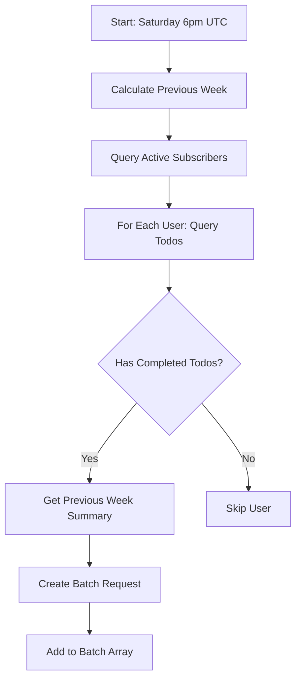
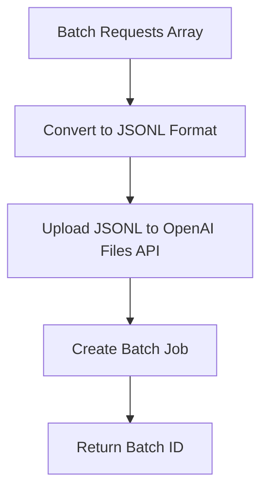
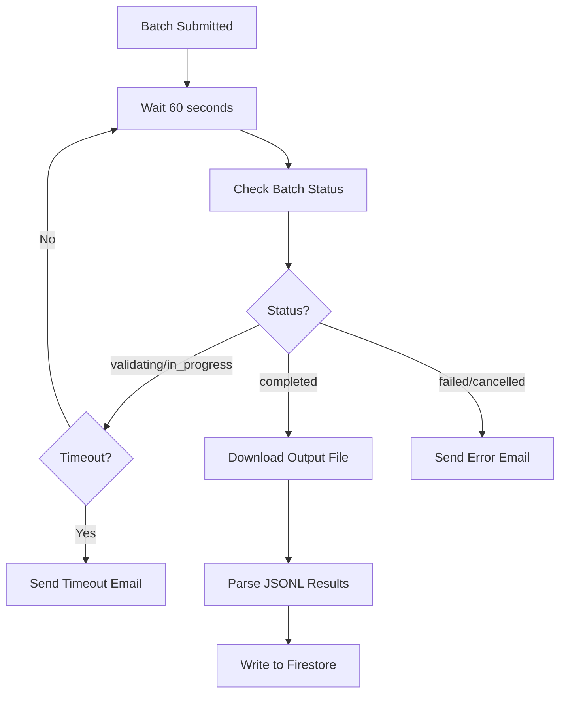
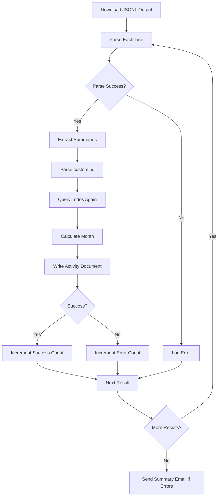

# AI Summary Batching System

## Overview

The Divergent Todos app generates AI-powered weekly summaries for all active subscribers using OpenAI's Batch API. This document describes the complete architecture and workflow of the batch processing system.

## Why Batch Processing?

**Cost Efficiency**: OpenAI's Batch API offers 50% cost reduction compared to standard API calls, making it economical to generate summaries for all users weekly.

**Parallel Processing**: Batch API processes multiple requests simultaneously, with a 24-hour completion window.

**Fire-and-Forget**: Submit batch jobs and poll for results, allowing Cloud Functions to handle large user bases within execution time limits.

## Architecture

### Components

1. **Batch Submission Function** (`generateWeeklySummaries.ts`)
   - Runs every Saturday at 6pm UTC via Cloud Scheduler
   - Scheduled at 6pm to ensure Friday has ended globally (including UTC-12)
   - Submits batch job to OpenAI (~30 seconds)
   - Saves batch job to Firestore for tracking
   - Sends confirmation email

2. **Batch Check/Consume Function** (`checkAndConsumeBatch.ts`)
   - Runs every 3 hours on Saturday & Sunday (14 checks over 43 hours)
   - Schedule: 3am, 6am, 9am, 12pm, 3pm, 6pm, 9pm, 12am UTC (both days)
   - First check at 9pm Saturday (3 hours after 6pm submission)
   - Checks pending batches from Firestore
   - Downloads and processes completed batches
   - Sends success email when batch completes
   - Cleans up old batch jobs (>7 days)

3. **Manual Trigger** (`triggerWeeklySummaries.ts`)
   - Callable function for admin testing
   - Allows custom week/year specification
   - Returns detailed execution results

4. **Batch Consumer** (`consumeBatch.ts`)
   - Manual consumption of completed batches
   - Allows reprocessing of specific batch IDs
   - Updates Firestore batch job status

5. **Batch Job Tracking** (`lib/batch-jobs.ts`)
   - Firestore schema for tracking batch jobs
   - Query and update batch job status
   - Automatic cleanup of old jobs

6. **Data Layer** (`lib/activity-data.ts`)
   - Queries user todos from Firestore
   - Enriches data with metadata (tags, move counts, timing)
   - Filters for active subscription users

7. **OpenAI Integration** (`lib/openai-batch.ts`)
   - Creates JSONL batch request files
   - Submits to OpenAI Batch API
   - Polls for completion status
   - Downloads and parses results

8. **Prompt Engineering** (`lib/openai-prompt.ts`)
   - Builds rich context prompts with metadata
   - Uses "attention" framing (not "completion")
   - Includes previous week's summary for continuity
   - Provides few-shot examples for consistency

## Workflow

### Phase 1: Data Collection



**Key Details:**
- Week numbers are sequential (1-53) for the entire year
- Only includes users with `subscription.status === "active"`
- Queries todos from Monday of target week onwards
- Includes both completed and incomplete todos
- Previous week's summary is fetched for continuity

### Phase 2: Batch Submission



**JSONL Format:**
Each line is a JSON object with:
- `custom_id`: `userId_year_week` (for result mapping)
- `method`: `"POST"`
- `url`: `"/v1/chat/completions"`
- `body`: Chat completion request with system/user messages

**Example:**
```json
{"custom_id":"user123_2025_42","method":"POST","url":"/v1/chat/completions","body":{"model":"gpt-4o-mini","messages":[{"role":"system","content":"You are an assistant..."},{"role":"user","content":"Given these todos..."}],"temperature":0.7,"response_format":{"type":"json_object"}}}
```

### Phase 3: Polling & Completion



**Polling Details:**
- Maximum 8 polls (8 minutes) due to Cloud Function timeout (9 min)
- 60-second intervals between status checks
- If timeout, sends email with batch ID for manual consumption

**Batch Statuses:**
- `validating`: OpenAI is validating the input file
- `in_progress`: Batch is being processed
- `completed`: Results ready for download
- `failed`: Batch failed (error file available)
- `cancelled`: Batch was cancelled

### Phase 4: Result Processing



**Activity Document Schema:**
```typescript
{
  userId: string,
  year: number,
  week: number,           // Sequential week (1-53)
  month: number,          // 0-11, from week start Monday
  completedTodos: Array<{
    date: string,         // ISO date
    text: string,         // HTML with tags
    createdAt: string,
    completedAt: string,
    moveCount: number,
    completedWithTimeBox: boolean,
    hasUrl: boolean,
    tags: string[]
  }>,
  incompleteCount: number,
  aiSummary: string,              // Formal summary
  aiPersonalSummary: string,      // Personal/motivational summary
  aiSummaryGeneratedAt: Timestamp,
  updatedAt: Timestamp
}
```

**Document ID:** `userId_year_week` (e.g., `abc123_2025_42`)

## AI Prompt Strategy

### Context Enrichment

The system provides rich metadata to help AI understand patterns:

- **Tags**: Themes/categories from todo descriptions
- **Move Count**: How many times todo was rescheduled (indicates shifting priorities)
- **Time to Complete**: Days from creation to completion
- **Same-day Completion**: Indicates reactive/quick work
- **Focused Sessions**: Todos completed with time-boxing
- **URLs**: External dependencies/references
- **Missing Dates**: Gaps in activity (lighter weeks)
- **Previous Week Summary**: For continuity between weeks

### Two Summary Types

**1. Formal Summary (First Person)**
- User's voice: "I spent my attention on..."
- Observational, non-judgmental
- Describes where attention went
- 3-4 sentences
- Uses "attention" and "focus" language (never "completed" or "achieved")

**Example:**
> "I spent most of my attention on observability and compliance this week, moving steadily through deeper documentation work. My focus stayed consistent with only a few quick follow-ups here and there. Planning and broader coordination stayed mostly in the background."

**2. Personal Summary (Second Person)**
- Encouraging message: "You gave attention to..."
- Celebrates how attention was spent
- Looks ahead to upcoming work
- 3-4 sentences
- Warm, light, motivating tone

**Example:**
> "You gave deep, intentional attention to observability and compliance this week — great rhythm. Things felt steady and grounded, with fewer reactive shifts. Next week might open space for some of that planning energy to come forward again."

### Few-Shot Learning

The prompt includes 3 example scenarios to guide AI responses:
1. **Focused & Deep Week**: Consistent attention, deep work, low reactivity
2. **Reactive & Fast-Moving Week**: Many quick tasks, high responsiveness
3. **Light / Reset Week**: Lower activity, space for rest

## Error Handling

### Email Notifications

System sends emails to admin for:
- **Batch Job Failures**: When OpenAI batch fails or is cancelled
- **Polling Timeout**: When function times out before batch completes
- **Processing Errors**: When individual user summaries fail

**Email Contents:**
- Timestamp of error
- Batch ID (for manual recovery)
- Error details and stack traces
- Success/error counts

### Retry Strategy

**Scheduled Function:**
- If times out during polling: Email sent with batch ID
- Admin can manually call `admin.scripts.consumeBatch(batchId)` to finish

**Individual Failures:**
- Logged but don't stop batch processing
- Collected in errors array
- Reported in final email summary

### Manual Recovery

If automated process fails:

```javascript
// 1. Trigger batch manually with specific week
admin.scripts.triggerWeeklySummaries(42, 2025)

// 2. Check status of batch
admin.scripts.checkBatchStatus("batch_abc123")

// 3. Consume completed batch manually
admin.scripts.consumeBatch("batch_abc123")
```

## Admin Tools

### Console Interface

Available via `window.admin.scripts` in browser console (admin UID only).

#### `triggerWeeklySummaries(week?, year?)`

Manually trigger batch generation for all active subscribers.

**Parameters:**
- `week`: Optional week number (defaults to previous week)
- `year`: Optional year (defaults to current year)

**Returns:**
```typescript
{
  success: boolean,
  batchId: string,
  week: number,
  year: number,
  totalUsers: number,
  requestsSubmitted: number,
  successCount?: number,
  errorCount?: number,
  skippedUsers?: string[],
  message?: string
}
```

**Example:**
```javascript
// Generate summaries for week 42, 2025
await admin.scripts.triggerWeeklySummaries(42, 2025)
```

#### `checkBatchStatus(batchId)`

Check status of a submitted batch job.

**Returns:**
```typescript
{
  batchId: string,
  status: string,
  outputFileId?: string,
  errorFileId?: string,
  requestCounts?: {
    total: number,
    completed: number,
    failed: number
  }
}
```

**Example:**
```javascript
await admin.scripts.checkBatchStatus("batch_abc123xyz")
```

#### `consumeBatch(batchId)`

Download and process results from a completed batch.

**Returns:**
```typescript
{
  success: boolean,
  batchId: string,
  successCount: number,
  errorCount: number,
  errors?: Array<{customId: string, error: string}>
}
```

**Example:**
```javascript
await admin.scripts.consumeBatch("batch_abc123xyz")
```

#### `generateWeekSummary(userId, week, year?, customAnalysisInstructions?)`

Generate summary for a single user (uses standard API, not batch).

**Use Cases:**
- Testing prompt changes
- Regenerating failed summaries
- Manual user requests

**Parameters:**
- `customAnalysisInstructions`: Optional custom prompt to experiment with different styles

**Example:**
```javascript
await admin.scripts.generateWeekSummary(
  "user123",
  42,
  2025,
  "Be more concise and focus only on tags"
)
```

## Cost Analysis

### Batch API Pricing (50% discount)

**Model**: GPT-4o-mini
- Standard API: $0.150 per 1M input tokens, $0.600 per 1M output tokens
- Batch API: $0.075 per 1M input tokens, $0.300 per 1M output tokens

**Typical Request:**
- Input: ~800-1500 tokens (prompt + todos + metadata)
- Output: ~150-250 tokens (two summaries)

**Cost per Summary:**
- Input: ~$0.0001 (0.1¢)
- Output: ~$0.00005 (0.05¢)
- **Total: ~$0.00015 (0.15¢) per user**

**Monthly Cost (example):**
- 100 active subscribers
- 4 batches per month
- **~$0.60/month total**

## Performance Characteristics

### Timing

**Batch Submission**: 2-5 seconds
- Upload JSONL file
- Create batch job

**Batch Processing**: 5-20 minutes (OpenAI)
- Depends on queue depth
- Typically completes within 10 minutes

**Result Download**: 1-3 seconds
- Parse JSONL output
- Extract summaries

**Firestore Writes**: 0.1s per user
- 100 users = 10 seconds
- Run in series to avoid rate limits

**Total**: ~10-25 minutes end-to-end

### Cloud Function Limits

**Timeout**: 540 seconds (9 minutes) for 2nd gen functions
- Allows ~8 minutes of polling
- If batch takes longer, function times out gracefully
- Admin can manually consume batch later

**Memory**: 512MiB
- Sufficient for processing 100s of users
- JSONL parsing is memory-efficient

## Security

### Authentication

- Scheduled function: Runs with service account (no auth required)
- Callable functions: Require authentication + admin UID check
- Admin UID: `iaSsqsqb99Zemast8LN3dGCxB7o2`

### Data Privacy

- API keys stored as Firebase Secrets
- No user data logged beyond UIDs
- Todos sent to OpenAI are anonymized (no user names/emails)
- OpenAI Batch API: Data deleted after 30 days

### Rate Limiting

- Firestore writes are serialized (not batched) to avoid throttling
- OpenAI Batch API handles rate limiting automatically

## Future Enhancements

### Potential Improvements

1. **Batch Result Caching**: Store batch ID in Firestore, allow background consumption
2. **Progressive Feedback**: Update UI as batch processes (via webhook)
3. **Failure Retry**: Automatic retry for failed individual requests
4. **Custom Prompts**: Per-user customization of summary style
5. **Multi-week Summaries**: Monthly/quarterly rollups
6. **Sentiment Tracking**: Analyze tone over time
7. **Tag Insights**: Surface trending themes across user base

### Scalability

Current design supports:
- **100s of users**: Single batch, completes in 10-20 minutes
- **1000s of users**: Multiple batches (split by cohort)
- **10,000+ users**: Queueing system with Firestore + background workers

## Monitoring

### Logs

All operations logged with structured data:

```typescript
logger.info("Batch job submitted", {
  batchId,
  week,
  year,
  totalRequests
})
```

**Key Log Points:**
- User query counts
- Batch submission success
- Polling iterations
- Individual write successes/failures
- Final summary statistics

### Email Alerts

Admin receives email for:
- Batch failures
- Polling timeouts
- Individual processing errors

### Metrics to Track

- Batch completion time
- Success/failure rates
- Per-user token usage
- OpenAI API costs
- Function execution duration

## References

### Related Files

- `/functions/src/generateWeeklySummaries.ts` - Scheduled function
- `/functions/src/triggerWeeklySummaries.ts` - Manual trigger
- `/functions/src/consumeBatch.ts` - Result consumption
- `/functions/src/lib/openai-batch.ts` - OpenAI Batch API client
- `/functions/src/lib/activity-data.ts` - Firestore data queries
- `/functions/src/lib/openai-prompt.ts` - Prompt construction
- `/apps/web/src/firebase/admin.ts` - Admin console interface

### External Documentation

- [OpenAI Batch API](https://platform.openai.com/docs/guides/batch)
- [Firebase Cloud Functions v2](https://firebase.google.com/docs/functions)
- [Cloud Scheduler](https://cloud.google.com/scheduler/docs)

---

**Last Updated**: December 2024
**Maintained By**: Christian Alfoni (christianalfoni@gmail.com)
